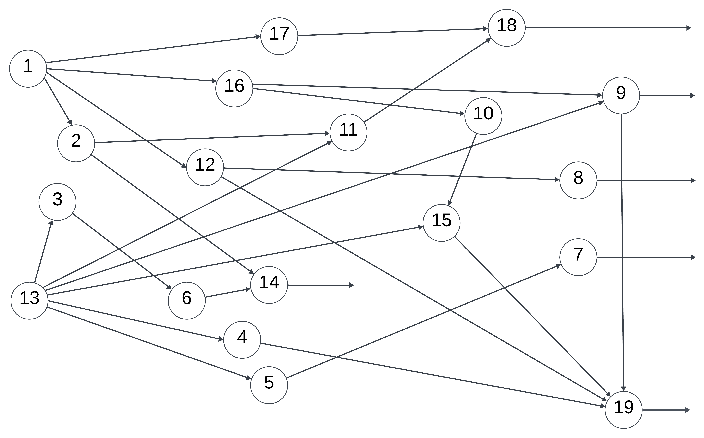
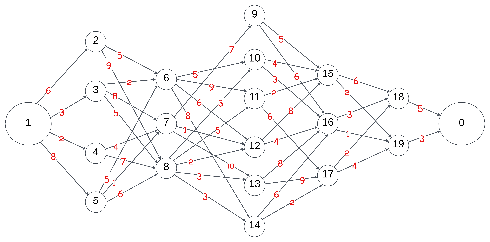

# **Graph Analysis: Longest & Shortest Path Algorithms**

This repository contains implementations for analyzing directed graphs using information flow methods. The focus is on two main tasks:

## **Task 1: Finding the Longest Path in a Directed Graph**
- Identifies input, intermediate, and output elements in a directed graph.
- Constructs adjacency and accessibility matrices.
- Determines the longest path using matrix exponentiation.
- Computes complexity, rationality, and redundancy coefficients.
- Detects cycles and evaluates system connectivity.

### **Graph Representation**

---

## **Task 2: Finding the Shortest Path in a Directed Graph**
- Computes the shortest path from a starting vertex to an ending vertex.
- Uses iterative methods for pathfinding.
- Implements and compares different algorithms:
  - **Dijkstra's Algorithm** (efficient for non-negative weights)
  - **Bellman-Ford Algorithm** (handles negative weights)
  - **Breadth-First Search (BFS)** (for unweighted graphs)

### **Graph Representation**

---

## **Usage**
- Input: Directed graph representation.
- Output: Path analysis results (longest and shortest path computations).
